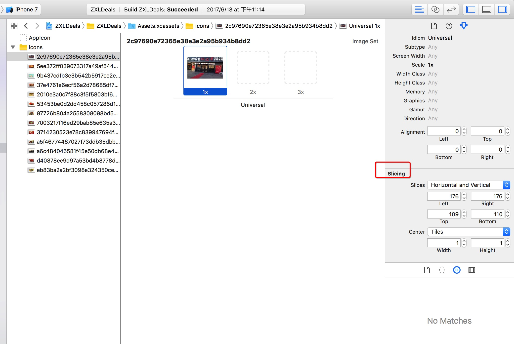
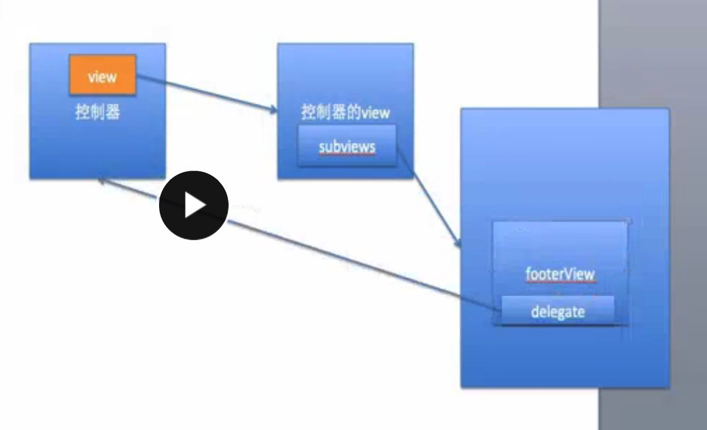
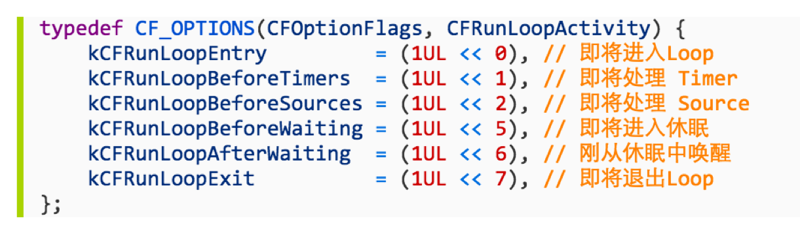
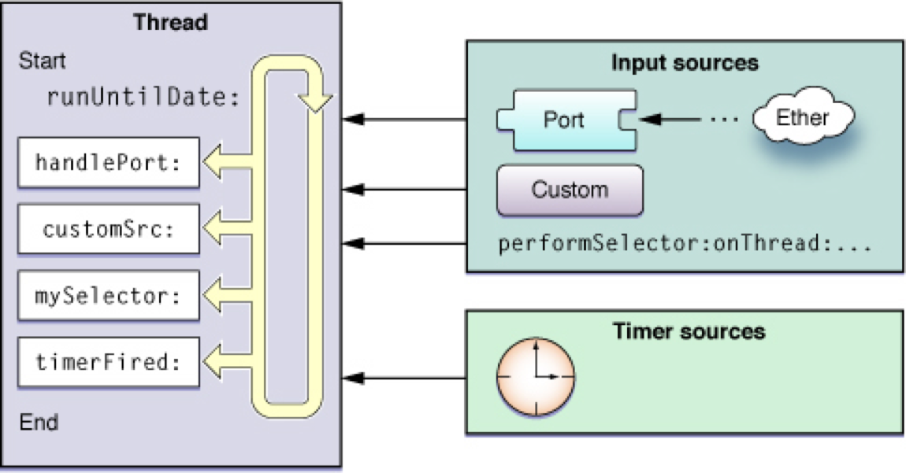
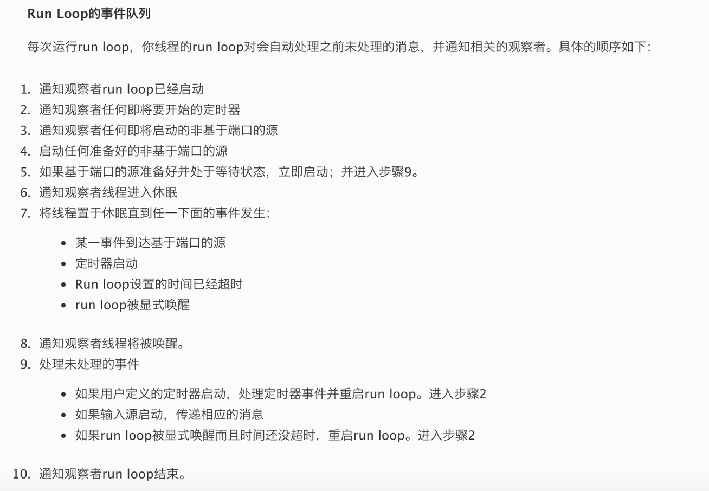
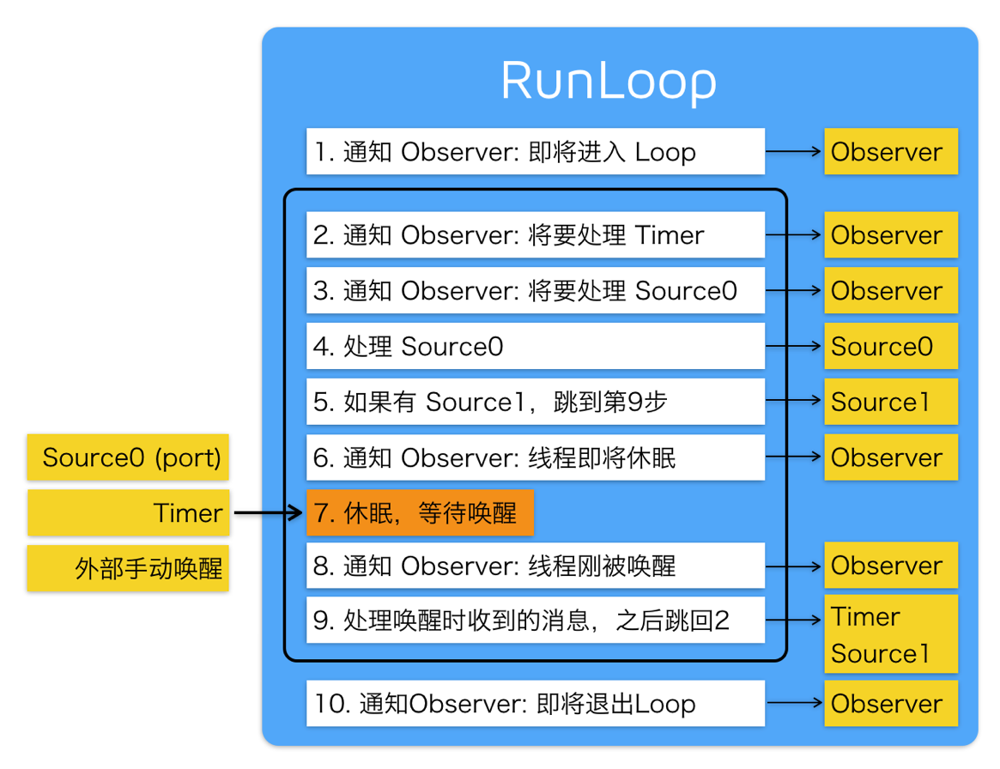
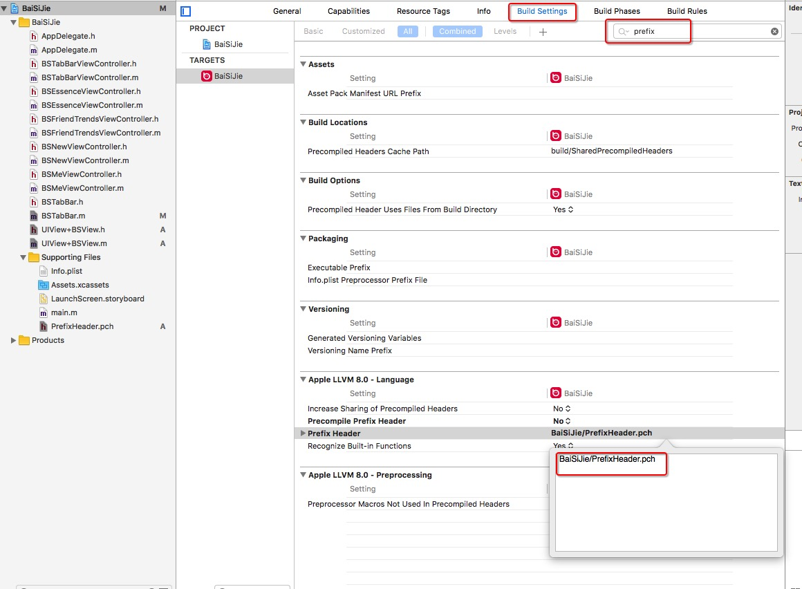

### 0613的问题:

#### 懒加载是通过在get方法中添加if判断实现的，如果为空就创建，不为空直接返回。

* 变量的初始化是可以写在**viewDidLoad**里
  * 放到viewDidLoad里增加阅读难度，代码不简洁
  * 可能会有不用的属性，但是放到viewDidLoad里会创建（实际项目中一般不会，创建的属性都是有用的）

~~~objective-c
- (NSArray *)deals{
    if (!_deals) {
        _deals = [NSArray arrayWithContentsOfFile:[[NSBundle mainBundle] pathForResource:@"tgs.plist" ofType:nil]];
    }
    NSMutableArray *tempArray = [NSMutableArray array];
    for (NSDictionary *dict in _deals) {
        DealModel *model = [DealModel dealWithDict:dict];
        [tempArray addObject:model];
    }
    _deals = tempArray;
    return _deals;
}
~~~

### 修改之后

~~~objective-c
- (NSMutableArray *)deals{
    if (!_deals) {
        _deals = [NSMutableArray array];
        NSArray *tempArray = [NSArray arrayWithContentsOfFile:[[NSBundle mainBundle] pathForResource:@"tgs.plist" ofType:nil]];
        for (NSDictionary *dict in tempArray) {
            DealModel *model = [DealModel dealWithDict:dict];
            [_deals addObject:model];
        }
    }
    return _deals;
}
~~~

### 0614问题

#### 纯代码方式封装控件

- 1.在initWithFrame:方法中添加子控件（此方法中不能设置frame，进行初始化的操作）
- 2.在layoutSubviews方法中设置子控件的frame
- 3.重写模型的set方法

### 0615问题

- 对于tableView插入单行数据时，建议使用insertRowsAtIndexPaths:withRowAnimation方法，因为它有reloadData的功能，且性能更高，只刷新当前行，同时也有删除一行数据的动画效果方法：deleteRowsAtIndexPath:withRowAnimation。reloadData刷新行时是刷新所有行

- 从数组里取出对象不能用.语法，因为从数组中取出的对象是id类型的（需要确定数组里的对象类型，确定之后可以使用.语法）。

- tableview选中之后可以使用deselectRowIndexPath:方法可以取消选中状态

- 不能一边遍历一边删除数据

- 苹果系统自带的批量操作

  ```objective-c
  self.tableView.allowsMultipleSelectionDuringEditing = YES;
  ```

### 0621问题

* 一般情况下，类似`AFNetworking`的第三方库导入时使用<>,自己自定义的类用“”导入，系统的类也可以使用“”导入。

- 返回cell的估计高度，此方法调用后返回cell高度的方法会在返回cell的方法之后调用

```objective-c
- (CGFloat)tableView:(UITableView *)tableView estimatedHeightForRowAtIndexPath:(NSIndexPath *)indexPath{
    return 150;
}
```

* 不用MVC坏处：

  ~~~objective-c
  1.扩展性低，如添加一个状态的标志，需要修改很多代码
  2.字典的键值对字符串容易写错
  3.字典的值为空值容易导致崩溃，模型的话最多是UI上不显示的问题
  4.可维护性不高，如果后台字段改变，需要修改n多地方，mvc可能就只需修改转模型时一次就行
  ~~~

* 图片拉伸方式

  * 1.最早的拉伸方式,只拉伸1*1px的距离，现在已经过期

  ~~~objective-c
  image = [image stretchableImageWithLeftCapWith:topCapHeight:];
  right = width - left - 1;
  bottom = height - top - 1;
  ~~~

  * 2.

  ~~~objective-c
  UIImage *image = [UIImage imageWithNamed:@"ad"];
  image = [image resizeableImageWithCapInsets:UIEdgeInsetMake(10,10,10,10)]; //表示上下左右分别保护10px的距离
  ~~~

  *  3.不用代码方式，直接在storyboard中拉伸
  *  在storyboard中选中图片库中的图片，然后在右侧属性栏中选择下面“Slicing”中可以选择“水平、垂直”方向进行拉伸，且已经计算完毕拉伸位置和模式！！
     *   

### 0625问题

* KVC/KVO

  * KVC: Key Value Coding, 常见作用：给模型属性赋值
  * KVO: Key Value Observing, 常用作用：监听模型属性值的改变

* KVO用法：

  ~~~objective-c
  1.添加要监听的属性
    [self.p1 addObserver:self forKeyPath:@"name" options: NSKeyValueObservingOptionOld context:nil];
  2.监听属性发生改变时都会调用下面方法，是继承自NSObject的方法，所有对象都能监听
  #pragma mark - KVO监听方法
  /**
   * 当监听到object的keyPath属性发生了改变
   */
  - (void)observeValueForKeyPath:(NSString *)keyPath ofObject:(id)object change:(NSDictionary *)change context:(void *)context
  {
      NSLog(@"监听到%@对象的%@属性发生了改变， %@", object, keyPath, change);
  }
  ~~~

* 代理和通知

  - 代理设计模式的作用:
    - 1.A对象监听B对象的一些行为，A成为B的代理
    - 2.B对象想告诉A对象一些事情，A成为B的代理
  - 代理设计模式的总结：
    - 如果你想监听别人的一些行为，那么你就要成为别人的代理
    - 如果你想告诉别人一些事情，那么就让别人成为你的代理
  - 代理设计模式的开发步骤
    - 1.拟一份协议（协议名字的格式：控件名 + Delegate），在协议里面声明一些代理方法（一般代理方法都是@optional）
    - 2.声明一个代理属性：@property (nonatomic, weak) id<代理协议> delegate;
    - 3.在内部发生某些行为时，调用代理对应的代理方法，通知代理内部发生什么事
    - 4.设置代理：xxx.delegate = yyy;
    - 5.yyy对象遵守协议，实现代理方法

  ~~~objective-c
  注意：代理调用方法时，成为代理的对象不一定实现代理方法，所以一定要判断是否有这个代理方法
    // 告诉代理
     if ([self.delegate  respondsToSelector:@selector(loadMoreFooterDidClickLoadMoreButton:)]) {
          [self.delegate loadMoreFooterDidClickLoadMoreButton:self];
      }
  ~~~

  ​

* 代理属性必须用weak，原因如下：

* static的作用：

  - 修饰局部变量
    - 让局部变量只初始化一次
    - 局部变量在程序中只有一份内存
    - 并不会改变局部变量的作用域，仅仅是改变了局部变量的生命周期（直到程序结束，这个局部变量才会销毁）
  - 修饰全局变量
    - 全局变量的作用域仅限于当前文件

## 实现拷贝的方法

- copy
  - 只会产生不可变的副本对象（比如NSString）
- mutableCopy
  - 只会产生可变的副本对象（比如NSMutableString）
- 

### 0626问题

- 问2-3年iOS开发经验的三个主要方面：
  - 事件处理：响应者链条
  - Runtime
  - RunLoop
- 主线程的主要作用：
  - 显示/刷新UI界面
  - 处理UI事件（比如点击事件、滚动事件、拖拽事件）
- 多线程常用的使用方案
- 一：GCD
  - 1.旨在替代NSThread等线程技术


- 2.充分利用设备的多核
- 3.C语言编写，自动管理线程生命周期，经常使用
- 二：NSOperation：
  - 1.基于GCD（底层是GCD）
  - 2.比GCD多了一些更简单实用的功能
  - 3.使用更加面向对象
  - 4.OC语言编写，自动管理线程生命周期，经常使用   

### 0628问题：单粒模式

#### 延迟执行的3中方式

- ​

```objective-c
[self performSelector:@selector(run) withObject:nil afterDelay:2.0];
```

- ​

```objective-c
dispatch_after(dispatch_time(DISPATCH_TIME_NOW, (int64_t)(2.0 * NSEC_PER_SEC)), dispatch_get_main_queue(), ^{
            NSLog(@"run-----");
        });
```

- ​

```objective-c
[NSTimer scheduledTimerWithTimeInterval:2.0 target:self selector:@selector(run) userInfo:nil repeats:NO];
```

#### GCD的常见函数

- 屏障：在此之前的函数先执行，在此之后的函数后执行，异步也是一样

```objective-c
dispatch_barrier_async
```

- ​

```objective-c
static dispatch_once_t onceToken;
    dispatch_once(&onceToken, ^{
        NSLog(@"------run");
    });
```

#### 单粒模式

* 调用alloc方法实际上底层是调用allWithZone方法

* 单粒模式的2中实现方式

  * 方式1：GCD方式

  ~~~objective-c
  // .h文件  (name)参数化，前面加##
  #define XMGSingletonH(name) + (instancetype)shared##name;

  // .m文件 1.宏定义：\表示换行，宏可以找到\下面的一行
  //2.alloc方法和copy方法实际上是调用的allocWithZone和copyWithZone方法，为了防止用户调用copy方法创建出第二份内存，实现了copyWithZone方法更严谨
  //3.static 是为了防止外界通过extern修改_instance的值添加的，也是为了安全
  #define XMGSingletonM(name) \
  static id _instance; \
   \
  + (instancetype)allocWithZone:(struct _NSZone *)zone \
  { \
      static dispatch_once_t onceToken; \
      dispatch_once(&onceToken, ^{ \
          _instance = [super allocWithZone:zone]; \
      }); \
      return _instance; \
  } \
   \
  + (instancetype)shared##name \
  { \
      static dispatch_once_t onceToken; \
      dispatch_once(&onceToken, ^{ \
          _instance = [[self alloc] init]; \
      }); \
      return _instance; \
  } \
   \
  - (id)copyWithZone:(NSZone *)zone \
  { \
      return _instance; \
  }
  ~~~

  * 方式2：加锁方式实现单粒：当多个线程同时创建对象时，添加锁可以防止多个线程同时创建对象

  ~~~objective-c
  static id _instance;

  + (instancetype)allocWithZone:(struct _NSZone *)zone
  {
      @synchronized(self) {//加锁的位置，在判断条件外
          if (_instance == nil) {
              _instance = [super allocWithZone:zone];
          }
      }
      return _instance;
  }

  + (instancetype)sharedInstance
  {
      @synchronized(self) {
          if (_instance == nil) {
              _instance = [[self alloc] init];
          }
      }
      return _instance;
  }

  - (id)copyWithZone:(NSZone *)zone
  {
      return _instance;
  }
  ~~~

  ​

### 0629问题:NSOperation

* NSOperation是个抽象类，并不具备封装操作的能力，必须使用它的子类

* 使用NSOperation子类的方式有3种
  * NSInvocationOperation： 用的少，
    * 默认情况下，调用了start方法后并不会开一条新线程去执行操作，而是在当前线程同步执行操作。
    * 只有将NSOperation放到一个NSOperationQueue中，才会异步执行操作
  * NSBlockOperation
  * 自定义子类继承NSOperation，实现内部相应的方法(main方法)

* 添加操作到NSOperationQueue中

  ~~~objective-cb
  - (void)addOperation:(NSOperation *)op;
  - (void)addOperationWithBlock:(void (^)(void))block;
  ~~~

  ​

#### GCD的队列类型

- 并发队列
  - 自己创建的
  - 全局
- 串行队列
  - 主队列
  - 自己创建的

#### NSOperationQueue的队列类型

- 主队列
  - [NSOperationQueue mainQueue]
  - 凡是添加到主队列中的任务（NSOperation），都会放到主线程中执行

- 非主队列（其他队列）
  - [[NSOperationQueue alloc] init]

  - 同时包含了：串行、并发功能：根据最大并发数的值确定是串行或者并发，最大并发数为1时，表示串行。-1表示线程数不受限制

    * 最大并发数的相关方法

      ~~~objective-c

      -(NSInteger)maxConcurrentOperationCount;

      -(void)setMaxConcurrentOperationCount:(NSInteger)cnt;
      ~~~

  - 添加到这种队列中的任务（NSOperation），就会自动放到子线程中执行

- 取消队列的所有操作

  ~~~objective-c
  -(void)cancelAllOperations;
  ~~~

  提示：也可以调用`NSOperation`的`-(void)cancel`方法取消单个操作

- 暂停和恢复队列

  ~~~objective-c
  - (void)setSuspended:(BOOL)b; // YES代表暂停队列，NO代表恢复队列
  - (BOOL)isSuspended;
  ~~~

- `NSOperation`之间可以设置依赖来保证执行顺序

  * 比如一定要让操作A执行完后，才能执行操作B，可以这么写

    ~~~objective-c
    [operationB addDependency:operationA]; // 操作B依赖于操作A
    ~~~

- 可以在不同queue的NSOperation之间创建依赖关系

  `注意：不能相互依赖;比如A依赖B，B依赖A`

- 可以监听一个操作的执行完毕

    ```objective-c
    -(void(^)(void))completionBlock;
    ```
    ```objective-c
    -(void)setCompletionBlock:(void(^)(void))block;
    ```

#### 自定义NSOperation的步骤很简单

* 重写`-(void)main`方法，在里面实现想执行的任务
  * 重写`-(void)main`方法的注意点
    * 自己创建自动释放池（因为如果是异步操作，无法访问主线程的自动释放池）
    * 经常通过`-(BOOL)isCancelled`方法检测操作是否被取消，对取消做出响应


### RunLoop:底层是个do...while（）“死循环”

#### 基本作用

* 保持程序的持续运行
* 处理App中的各种事件（比如触摸事件、定时器事件、Selector事件）
* 节省CPU资源，提高程序性能：该做事时做事，该休息时休息
* ………….

#### RunLoop对象

* iOS中有2套API来访问和使用RunLoop
  * Foundation
    * NSRunLoop
  * Core Foundation
    * Core Foundation
* NSRunLoop和CFRunLoopRef都代表着RunLoop对象
* NSRunLoop是基于CFRunLoopRef的一层OC包装，所以要了解RunLoop内部结构，需要多研究CFRunLoopRef层面的API（Core Foundation层面）
* CFRunLoopRef是开源的

#### RunLoop与线程

* 每条线程都有唯一的一个与之对应的RunLoop对象
* 主线程的RunLoop已经自动创建好了，子线程的RunLoop需要主动创建
* RunLoop在第一次获取时创建，在线程结束时销毁

#### 获得RunLoop对象

* Foundation

~~~objective-c
[NSRunLoop currentRunLoop];// 获得当前线程的RunLoop对象

[NSRunLoop mainRunLoop];// 获得主线程的RunLoop对象
~~~

* Core Foundation

~~~objective-c
CFRunLoopGetCurrent();// 获得当前线程的RunLoop对象

CFRunLoopGetMain();// 获得主线程的RunLoop对象
~~~

#### RunLoop相关类

* Core Foundation中关于RunLoop的5个类
  * CFRunLoopRef
  * CFRunLoopModeRef
  * CFRunLoopSourceRef
  * CFRunLoopTimerRef
  * CFRunLoopObserverRef
* 

#### CFRunLoopModeRef

* CFRunLoopModeRef代表RunLoop的运行模式
* 一个 RunLoop 包含若干个 Mode，每个Mode又包含若干个Source/Timer/Observer
* 每次RunLoop启动时，只能指定其中一个 Mode，这个Mode被称作 CurrentMode
* 如果需要切换Mode，只能退出Loop，再重新指定一个Mode进入
* 这样做主要是为了分隔开不同组的Source/Timer/Observer，让其互不影响
* 系统默认注册了5个Mode:
  * `kCFRunLoopDefaultMode`：App的默认Mode，通常主线程是在这个Mode下运行
  * `UITrackingRunLoopMode`：界面跟踪 Mode，用于 ScrollView 追踪触摸滑动，保证界面滑动时不受其他Mode 影响
  * UIInitializationRunLoopMode: 在刚启动 App 时第进入的第一个 Mode，启动完成后就不再使用
  * GSEventReceiveRunLoopMode: 接受系统事件的内部 Mode，通常用不到
  * `kCFRunLoopCommonModes`: 这是一个占位用的Mode，不是一种真正的Mode

#### CFRunLoopSourceRef

* CFRunLoopSourceRef是事件源（输入源）
* 以前的分法
  * Port-BasedSources
  * Custom InputSources
  * Cocoa PerformSelector Sources
* 现在的分法
  * Source0：非基于Port的
  * Source1：基于Port的

#### CFRunLoopTimerRef

* CFRunLoopTimerRef是基于时间的触发器
* 基本上说的就是NSTimer

#### CFRunLoopObserverRef

* CFRunLoopObserverRef是观察者，能够监听RunLoop的状态改变
* 可以监听的时间点有以下几个
  * 

#### RunLoop处理逻辑-官方版

* 
* 

#### RunLoop处理逻辑-网友整理版

* 

#### RunLoop应用

* NSTimer
* ImageView显示：滑动scrollView时不显示图片，滑动结束显示图片
* PerformSelector
* 常驻线程:
  * 1.每次runloop运行之前会先判断mode是不是为空，如果为空，直接一开起就结束了
* 自动释放池：在RunLoop睡眠之前会释放（kCFRunLoopBeforeWaiting）


#### CoreText


#### RunLoop面试题

* 什么是RunLoop
  * 1.从字面意思看，是运行循环、跑圈
  * 2.其实底层是do-while循环，在这个循环内部不断的处理各种任务（比如Source、Timer、Observer）
  * 一个线程对应一个RunLoop，主线程的RunLoop默认已经启动，子线程的RunLoop得手动启动（调用run方法）
  * RunLoop默认只能选择一个Mode启动，如果当前Mode中没有任何Source、Timer、Observer，那么就直接退出RunLoop
* 在开发中如何使用RunLoop？什么应用场景？
  * 开启一个常驻线程（让一个子线程不进入消亡状态，等待其他线程发来消息，处理其他事件）
    * 在子线程中开启一个定时器
    * 在子线程中进行一些长期监控
  * 可以控制定时器在特定模式下执行
  * 可以让某些事件（行为、任务）在特定模式下执行
  * 可以添加Observer监听RunLoop状态，比如监听点击事件的处理（在所有点击事件之前做一些事情）


#### GCD定时器

* `dispatch_source_t`是一个类(OC对象)，声明变量时，不带*，因为内部已经包含了*

~~~objective-c
int count = 0;
- (void)touchesBegan:(NSSet *)touches withEvent:(UIEvent *)event
{
    // 获得队列
//    dispatch_queue_t queue = dispatch_get_global_queue(0, 0);
    dispatch_queue_t queue = dispatch_get_main_queue();
    
    // 创建一个定时器(dispatch_source_t本质还是个OC对象)
    self.timer = dispatch_source_create(DISPATCH_SOURCE_TYPE_TIMER, 0, 0, queue);
    
    // 设置定时器的各种属性（几时开始任务，每隔多长时间执行一次）
    // GCD的时间参数，一般是纳秒（1秒 == 10的9次方纳秒）
    // 何时开始执行第一个任务
    // dispatch_time(DISPATCH_TIME_NOW, 1.0 * NSEC_PER_SEC) 比当前时间晚3秒
    dispatch_time_t start = dispatch_time(DISPATCH_TIME_NOW, (int64_t)(1.0 * NSEC_PER_SEC));
    uint64_t interval = (uint64_t)(1.0 * NSEC_PER_SEC);
    dispatch_source_set_timer(self.timer, start, interval, 0);
    
    // 设置回调
    dispatch_source_set_event_handler(self.timer, ^{
        NSLog(@"------------%@", [NSThread currentThread]);
        count++;
        if (count == 4) {
            // 取消定时器
            dispatch_cancel(self.timer);
            self.timer = nil;
        }
    });
    
    // 启动定时器
    dispatch_resume(self.timer);
  
  //dispatch_source_create   虽然是creat，但是不用手动release。但是CF函数的还是需要手动release
}
~~~

### 3.多用字面量语法，少用与之等价的方法

~~~objective-c
NSString、NSNumber、NSArray、NSDictionary都属于Foundation框架
  
建议使用：
  NSStirng *str1 = @"hello";
  NSNumber *someNum = @2;
  NSNumber *someNum = @2.3f;
  NSNumber *someNum = @YES;
  NSArray *animals = @[obj1,obj2,obj3];
  dog = animals[2];
  NSDictionary *dict = @{
                           @"name":@"zxl",
                           @"sex":@"f",
                           @"age":@22
                           };
NSString *name = @[@"name"];
不建议使用：
  NSNumber *someNum = [NSNumber numberWithInt:1];
  NSArray *array = [NSArray arrayWithObjects:obj1,obj2,obj3];
  sd = [animal objectAtIndex:2];
  NSDictionary *dict = [NSDictionary dictionaryWithObjectsAndKeys:@"name",@"zxl",@"age",@22, nil];
  NSString *sd = [dict objectForKey:@"name"];
~~~

* 使用字面量语法（语法糖：计算机语言中与另外一套语法等效但是开发者用起来更加方便的语法。可令程序更易读，减少代码出错几率）可以缩减源代码长度，使其更为易读。字面量语法更精简
* 字面量语法对于数组来说，更容易操作数组。使用字面量语法创建数组时需注意，若数组元素对象中有nil则会抛出异常。对于上述例子中两种创建数组的方式，若obj1、obj3是有效对象，obj2是nil。若是按照字面量语法创建，则会抛出异常，若是按照不建议使用的方式创建则array中只有obj1这一个对象。
  * 原因在于：`arrayWithObjects：`这个方法会依次处理各个参数，直到发现nil为止，因为obj2是nil，所以该方法会提前结束
  * 这表明：字面量语法更安全。抛出异常令app终止执行，这比创建好数组之后才发现元素个数少了要好。向数组中插入nil通常说明程序有错，而通过异常可以更快的发现这个错误
* 字面量语法局限性

### 4.多用类型常量，少用#define预处理指令

* static const NSTimeInterval kAnimationDuration = 0.3; 用此方式定义的常量包含类型信息，好处是清楚的描述了常量的含义。有助于为其编写开发文档。

* 若常量局限于某“编译单元”（实现文件）之内，则在前面加字母k；若常量在类之外可见，则通常以类名为前缀。

* 若不打算公开某个常量，则应将其定义在使用该常量的实现文件里。

* 变量一定要用static和const来声明。如果试图修改由const修饰符所声明的变量，那么编译器就会报错。而static修饰符则意味着该变量仅在定义此变量的编译单元可见。编译器每收到一个编译单元，就会输出一份“目标文件”。在OC语境下，“编译单元”通常指每个类的实现文件（以.m为后缀名）。若果声明变量时不加static，则编译器会为他创建一个“外部符号”，成绩是若是另一个编译单元中也声明了同名变量，那么编译器会抛出错误信息。若是一个变量既声明了static又声明了const，那么编译器不会创建符号，会像#define预处理指令一样，把所有的变量都替换为常值。不过还是要记住：用static const这种方式定义的常量带有类型信息。

* 全局符号表：可以在定义该常量的编译单元之外访问。

  ~~~objective-c
  //在头文件中“声明”
  extern NSString *const EOCStringConstant;

  //在实现文件中“定义”
  NSString *const EOCStringConstant = @"VALUE";
  ~~~

  * extern 关键字是要告诉编译器，在全局符号表中将有一个名叫EOCStringConstant的符号。也就是说，编译器不需要查看其定义，即允许代码使用此常量。因为它知道，当链接成二进制文件后，肯定能找到这个常量。
  * 此类常量必须要定义，而且只能定义一次。通常将其定义在与生命该常量的头文件相关的实现文件里。有实现文件生成目标文件时，编译器会在“数据段”为字符串分配存储空间。链接器会把此目标文件与其他文件相链接，以生成最终的二进制文件。凡是用到EOCStringConstant这个全局符号的地方，链接器都将其解析。

~~~
* 不要用预处理指令定义常量。这样定义出来的常量不含类型信息，编译器只是会在编译前据此执行查找与替换操作。即使有人重新定义了常量值，编译器也不会产生警告信息，这将导致应用程序中的常量值不一致。
* 在实现文件中使用static const来定义“只在编译单元内可见的常量”，由于此常量不在全局符号表中，所以无须为其名称加前缀。
* 在头文件中使用extern来声明全局变量，并在相关实现文件中定义其值。这种常量要出现在全局符号表中，所以其名称用那个加以区隔，通常用与之相关的类名做前缀。
~~~

### 5、用枚举表示状态、选项、状态码

~~~
* 应该用枚举表示状态机的状态、传递给方法的选项以及状态码等值，给这些值起个易懂的名字。
* 如果把传递给某个方法的选项表示为枚举类型，而多个选项又可同时使用，那么就将各选项值定义为2的幂，以便通过按位或操作将其组合起来。
* 用NS_NUM与NS_OPTIONS宏来定义枚举类型，并指明其底层数据类型。这样做可以确保枚举是开发者所选的底层数据类型实现出来的，而不会采用编译器所选的类型
* 在处理枚举类型的switch语句中实现default分值。这样的话，加入新枚举之后，编译器就会提示开发者：switch语句并未处理所有枚举。
~~~


# 百思不得姐

#### 第一天

* appearance：[UITabBarItem appearance]
  * 可以通过appearance统一设置所有UITabBarItem的文字属性
  * 方法名后面带有UI_APPEARANCE_SELECTOR的方法，都可以通过appearance对象来统一设置。如：setTitleTextAttributes:forState方法

* 设置UITabBarController的tabBar属性时，由于tabBar属性是只读的，所以只能通过KVC进行对tabBar赋值

  ~~~objective-c
  //tabBar是只读的属性，只能通过KVC进行赋值,BSTabBar是自定义tabBar，self是自定义的UITabBarController
  [self setValue:[[BSTabBar alloc] init] forKeyPath:@"tabBar"];
  ~~~

* 自定义tabBar时，可以通过遍历tabBar的子视图，进行对tabBar的重新布局

  ~~~objective-c
      NSInteger index = 0;
      CGFloat viewY = 0;
      CGFloat viewW = self.width * 0.2;
      CGFloat viewH = self.height;
  for (UIView *view in self.subviews) {
  //        if (![view isKindOfClass:NSClassFromString(@"UITabBarButton")]) {
  //            continue;
  //        }
          if (![view isKindOfClass:[UIControl class]] || view == self.publishBtn) {
              continue;
          }
          //计算子控件的x时，跳过发布按钮位置，由于发布按钮与其他4个按钮在数组中的顺序不知道，所以依次设置x更麻烦，所以单独设置发布按钮的frame更简单
          CGFloat viewX = viewW * ((index > 1)?(index + 1):index);

          view.frame = CGRectMake(viewX, viewY, viewW, viewH);
          index++;
      }
  ~~~

* 将pch文件引入项目中，首先创建pch文件，然后将需要引入的头文件，写在pch文件中，最后在Build Setting里设置，其中pch文件路径若是修改之后，下图相应位置也需要修改。

  ~~~objective-c
  #ifndef PrefixHeader_pch
  #define PrefixHeader_pch

  #import "UIView+BSView.h"

  #endif 
  ~~~

  

#### 第二天（0712）

* 新增UIBarButtonItem的分类：根据苹果的惯用思路，创建控件时类似`UIButton *tagBtn = [UIButton buttonWithType:UIButtonTypeCustom]`使用类方法进行创建。设置每个控制器的导航栏，可以给UIBarButtonItem新增分类，根据需要添加参数。

  ~~~objective-c
  + (instancetype)itemWithTarget:(id)target action:(SEL)action image:(NSString *)image selectedImage:(NSString *)selectedImage
  {
      UIButton *tagBtn = [UIButton buttonWithType:UIButtonTypeCustom];
      [tagBtn setBackgroundImage:[UIImage imageNamed:image] forState:UIControlStateNormal];
      [tagBtn setBackgroundImage:[UIImage imageNamed:selectedImage] forState:UIControlStateHighlighted];
      tagBtn.size = tagBtn.currentBackgroundImage.size;
      [tagBtn addTarget:target action:action forControlEvents:UIControlEventTouchUpInside];
      return [[self alloc] initWithCustomView:tagBtn];
  }
  ~~~

* 对于UITabBarController，肯定会有几个根控制器，在给UITabBarController添加子控制器时，尽量不要用到子控制器的view，防止子控制器的view被提前创建。如下代码是创建UITabBarController的子控制器，注释行代码尽量不加，子控制器的view尽量是使用时再创建，即注释行代码尽量在对应的子控制器的viewDidLoad里写

  ~~~objective-c
  - (void)setupChildViewController:(UIViewController *)vc WithTitle:(NSString *)title image:(NSString *)image selectedImage:(NSString *)selectedImage
  {
      //设置子控制器的文字和图片
      vc.title = title;
      vc.tabBarItem.image = [UIImage imageNamed:image];
      vc.tabBarItem.selectedImage = [UIImage imageNamed:selectedImage];
      //vc.view.backgroundColor = [UIColor redColor];
      UINavigationController *nav = [[UINavigationController alloc] initWithRootViewController:vc];
      //添加子控制器
      [self addChildViewController:nav];
  }
  ~~~

  ​


### 0723 键盘处理的细节

* 1.更换系统的键盘和键盘顶部的工具条

  ~~~objective-c
  // 更换键盘
  UIView *keyboard = [[UIView alloc] init];
  keyboard.frame = CGRectMake(0, 0, 0, 100);
  keyboard.backgroundColor = [UIColor redColor];
  self.emailField.inputView = keyboard; //关键
      
  // 设置键盘顶部的工具条;
  UIView *toolbar = [[UIView alloc] init];
  toolbar.frame = CGRectMake(0, 0, 0, 44);
  toolbar.backgroundColor = [UIColor blueColor];
  self.nameField.inputAccessoryView = toolbar;//关键
  ~~~

* 2.owner的使用

  ~~~objective-c
  // 加载工具条控件
  UIToolbar *toolbar = [[[NSBundle mainBundle] loadNibNamed:@"XMGKeyboardTool" owner:self options:nil] firstObject];
  //owner一般传nil 但是也可以传其他任何对象，如果传其他对象，相应的该对象也需要实现对应的方法，owner就是监听xib中控件的事件
  ~~~

* 3.自定义键盘上的工具条

  * 自定义键盘上的工具条，可以使用代理-协议的样式监听工具条上按钮的点击


### 0726问题

#### 运行时（Runtime）

* 苹果官方一套C语言库

* 能做很多底层操作(比如访问隐藏的一些成员变量\成员方法....)

* 如果想知道一个控件所有的成员变量和方法可以使用如下方法：

  ~~~objective-c
  + (void)initialize
  {//查看UITextField的属性和方法
    
      unsigned int count = 0;
      
      // 拷贝出所有的成员变量列表
      Ivar *ivars = class_copyIvarList([UITextField class], &count);
      
      for (int i = 0; i<count; i++) {
          // 取出成员变量
          //        Ivar ivar = *(ivars + i);
        //数组名其实就是数组首元素的指针
          Ivar ivar = ivars[i];
          
          // 打印成员变量名字
          XMGLog(@"%s %s", ivar_getName(ivar), ivar_getTypeEncoding(ivar));
      }
      // 释放
      free(ivars);
  }
  ~~~

* 修改文本框聚焦和失去焦点时需要做的事，比如修改文本颜色，可以重写如下方法：

  ~~~objective-c
  /**
   * 当前文本框聚焦时就会调用
   */
  - (BOOL)becomeFirstResponder;
  /**
   * 当前文本框失去焦点时就会调用
   */
  - (BOOL)resignFirstResponder;
  ~~~


#### 0727

* 通过写百思不得姐的推送引导页面和登录注册页面新的：自定义控件时，尽量把处理逻辑的代码封装在自定义控件内，外部只需调用即可。可以通过Runtime找到控件内隐藏的成员变量或者属性。注意多重写父类的方法可以实现很多功能，比如重写文本框的`becomeFirstResponder`和`resignFirstResponder`就可以控制文本框聚焦和失去焦点时发生的情况。

### 0729问题：上下联动控件(页卡)的封装注意点

* 1. 首先创建scrollView；因为页卡和scrollView都是放在控制器的view上，因为创建先后的问题可能添加scrollView时需要`insertSubview:atIndex:`

  2. 因为tabbar和navigationBar和页卡页面有透明的效果，且能看到内容，所以需要设置scrollView的大小就是整个页面的大小，如果内容也是整个页面大小，则tabbar和navigationBar和页卡就会遮挡部分内容，所以需要设置scrollView的内边距，`contentInset = UIEdgeInsetsMake(CGRectGetMaxY(self.bgView.frame), 0, self.tabBarController.tabBar.height, 0);`。由于每个页卡之间的内容滑动不关联，所以是每个页卡下是个tableView，所以就不需要设置scrollView的contentInset，只需分别设置每个tableView的contentInset。

  3. 监听scrollView的`(void)scrollViewDidEndScrollingAnimation:(UIScrollView *)scrollView`的事件，设置contentOffset时需要`[self.contentScrollView setContentOffset:offset animated:YES];`这么设置，动画结束这个代理方法才会走，如果直接设置或者animated:NO这个方法照样不会走。学会多看苹果文档，文档上写的很清楚。

  4. navigationBar的高度是44，通常说的64是因为算上了20的状态栏的高度

  5. ~~~objective-c
     //设置滚动条的内边距
     self.tableView.scrollIndicatorInsets = self.tableView.contentInset;
     ~~~

  6. 通常设置像百思不得姐这样上下联动的页卡页面，点击按钮时，scrollView滚动，是通过绑定点击按钮的tag值进行区别的。

  7. 将请求到的复杂数据写入plist文件中，可以 清楚的看到结构

  8. ~~~objective-c
     [responseObject writeToFile:@"/Users/zhengxueli/Desktop/duanzi.plist" atomically:YES];
     ~~~

  9. 对于网络请求，网络慢时，请求到的数据错乱问题的处理：

     * 使用中间变量保存请求参数，每次请求先保存参数，请求成功后，判断参数是否一致，如果不一致，直接return


### 0807问题：弹簧动画

* 第三方实现的弹簧动画pop

  ~~~objective-c
  /**
   pop和Core Animation的区别
   1.Core Animation的动画只能添加到layer上
   2.pop的动画能添加到任何对象
   3.pop的底层并非基于Core Animation, 是基于CADisplayLink
   4.Core Animation的动画仅仅是表象, 并不会真正修改对象的frame\size等值
   5.pop的动画实时修改对象的属性, 真正地修改了对象的属性
   */
  ~~~

* 动画的实现

~~~objective-c
// 按钮动画
POPSpringAnimation *anim = [POPSpringAnimation animationWithPropertyNamed:kPOPViewFrame];
anim.fromValue = [NSValue valueWithCGRect:CGRectMake(buttonStartX, buttonBeginY, buttonW, buttonH)];
anim.toValue = [NSValue valueWithCGRect:CGRectMake(buttonEndX, buttonEndY, buttonW, buttonH)];
anim.springBounciness = 10;
anim.springSpeed = 10;
anim.beginTime = CACurrentMediaTime() + 0.1 * i;
[btn pop_addAnimation:anim forKey:nil];
~~~

* 半透明效果的实现
  * 做好的半透明的view添加到主窗口上
  * 窗口的级别（windowLevel）：UIWindowLevelNormal < UIWindowLevelStatusBar < UIWindowLevelAlert
  * 想让初始化的窗口显示直接window.hidden=NO即可


### 0904问题

* 对于字符串的copy/strong用法差异：对与NSString的情况使用copy和strong是一样的，对于NSMutableString而言，copy比strong更安全，因为strong在可变的值改变时可能会对业务逻辑造成影响。

### 0910问题

~~~
实现property所声明的方法的定义。其实说直白就像是：property声明了一些成员变量的访问方法，synthesize则定义了由property声明的方法。

  他们之前的对应关系是:property 声明方法 ->头文件中申明getter和setter方法 synthesize定义方法 -> m文件中实现getter和setter方法。

  在Xcode4.5及以后的版本中，可以省略@synthesize，编译器会自动帮你加上get 和 set 方法的实现，并且默认会去访问_age这个成员变量，如果找不到_age这个成员变量，会自动生成一个叫做 _age的私有成员变量。在.m文件中同时实现getter和setter时候需要@synthesize age = _age.

用处：可以使修饰的属性直接通过名字来访问，而不用加_和self.
~~~


### 1128问题

* 属性、通知、代理、block的理解

1.属性传值什么时候用恰当？b在a内创建或者b是a的属性时，多用于push时，列表页向详情页传值。

~~~objective-c
- (void)tableView:(UITableView *)tableView didSelectRowAtIndexPath:(NSIndexPath *)indexPath
{
    [tableView deselectRowAtIndexPath:indexPath animated:YES];
    SPOrderListModel *orderModel = self.dataSource[indexPath.row];
    SPOrderDetailsVC *orderDetailsVC = [[SPOrderDetailsVC alloc] init];
    orderDetailsVC.hidesBottomBarWhenPushed = YES;
    orderDetailsVC.ID = orderModel.ID;
    WS(weakSelf);
    orderDetailsVC.block = ^(NSInteger index) {
        [weakSelf.dataSource removeObjectAtIndex:indexPath.row];
        [weakSelf.tableView reloadData];
        //通过回调改变父控制器选中的btn
        SPOrderViewController *orderVC = (SPOrderViewController *)weakSelf.parentViewController;
        [orderVC changePageViewIndex:index];
    };
    [self.navigationController pushViewController:orderDetailsVC animated:YES];
}
~~~

2.代理、block：回调，一个逻辑，传值。用于在详情页做操作，例如接单、添加商品。然后让列表页有一些改变。

~~~objective-c
if ([data[@"act"] isEqualToString:@"supplier__order_accept"]) { //开始处理
        if ([data[@"re_code"] integerValue] == 0) { //请求成功
            [self showHudInVC:self Text:@"接单成功" sleepTime:1.0 isNeedPopBool:YES];
            // 接单成功后，返回订单列表页面，选中‘待配送’页签--1
            if (self.block) {
                self.block(1);
            }
        } else {
            [self showHudInVC:self Text:data[@"re_message"] sleepTime:1.0 isNeedPopBool:NO];
        }
    }
~~~

3.通知：与以上3种方式不同，a拿不到b时，使用通知；一对多的关系时；例如登录，消息的红点显示

* 对于数据的处理，应该放在model层，而不是放在controller或者view层。
  * 提高代码可读性
  * 提高性能（不用多次处理）
* 栗子：数据判空保护防UI错乱、崩溃。时间戳转换。cell文字高度计算。屏蔽相关功能


#### 注意：

* 对于能加载更多这一类型的接口，在刷新数据时，一定要把偏移量归0.

<<<<<<< HEAD
### 1228

* 模态控制器：

  ~~~objective-c
  self.modalPresentationStyle = UIModalPresentationCustom;

  修改style为custom时，模态出来的控制器会覆盖在原来控制器上，可以实现遮罩的效果，系统默认的弹出的新的控制器之后，原来的控制器系统会拿掉。无法实现遮罩的效果。
  ~~~


### 1229

* KVO观察实例及参数说明：

  * 假设有一个类Person，控制器要监听p.name的改变

  ~~~objective-c
  /**
   1. self.person：要监听的对象
   2. 参数说明：
      * @param addObserver  观察者，负责处理监听事件的对象
      * @param forKeyPath 要监听的属性
      * @param  options 观察的选项（观察新、旧值，也可以都观察）
      * @param context 上下文，用于传递数据，可以利用上下文区分不同的监听
   */
  - (void)viewDidLoad {
      _p.name = @"zxl";
      [_p.name addObserver:self forKeyPath:@"name" options:NSKeyValueObservingOptionNew | NSKeyValueObservingOptionOld context:nil];
  }

  - (void)touchesBegan:(NSSet<UITouch *> *)touches withEvent:(UIEvent *)event
  {
      _p.name = @"jcl";
  }
  /**
   *  当监控的某个属性的值改变了就会调用
   *
   *  @param keyPath 监听的属性名
   *  @param object  属性所属的对象
   *  @param change  属性的修改情况（属性原来的值`oldValue`、属性最新的值`newValue`）
   *  @param context 传递的上下文数据，与监听的时候传递的一致，可以利用上下文区分不同的监听
   */
  -(void)observeValueForKeyPath:(NSString *)keyPath ofObject:(id)object change:(NSDictionary<NSKeyValueChangeKey,id> *)change context:(void *)context
  {
      NSLog(@"%@",change[NSKeyValueChangeNewKey]);
  }
  ~~~

* KVO:当被观察对象的某个属性发生更改时，观察者对象会获得通知。

* KVO底层原理实现：

  * KVO是基于runtime机制实现的
  * 当某个类的属性对象`第一次被观察`时，系统就会在运行期`动态`地创建`该类的一个派生类`，在这个派生类中重写基类中任何被观察属性的setter 方法。派生类在被重写的setter方法内实现真正的`通知机制`
  * 如果原类为Person，那么生成的派生类名为`NSKVONotifying_Person`
  * 每个类对象中都有一个isa指针指向当前类，当一个类对象的第一次被观察，那么系统会偷偷将isa指针指向动态生成的派生类，从而在给被监控属性赋值时执行的是派生类的setter方法
  * 键值观察通知依赖于NSObject 的两个方法: `willChangeValueForKey:` 和 `didChangevlueForKey:`；在一个被观察属性发生改变之前， `willChangeValueForKey:`一定会被调用，这就 会记录旧的值。而当改变发生后，`didChangeValueForKey:`会被调用，继而 `observeValueForKey:ofObject:change:context: `也会被调用。
  * 补充：KVO的这套实现机制中苹果还偷偷重写了class方法，让我们误认为还是使用的当前类，从而达到隐藏生成的派生类

  
=======
### 2018.1.4

* 1.当业务逻辑的判断条件比较混乱时，尽量通过增加model的属性和方法使其形象化。
* 2.动态页面弱化行、组、tag等于具体数字的概念，而是通过组行tag取出对应的model或者字符串，然后通过model.type或者字符串来判断该位置的内容。
* 3.分析问题时要找出问题所在的点。
* ​


>>>>>>> b7f52818355a35ac658d289f72745368f4b3178f

