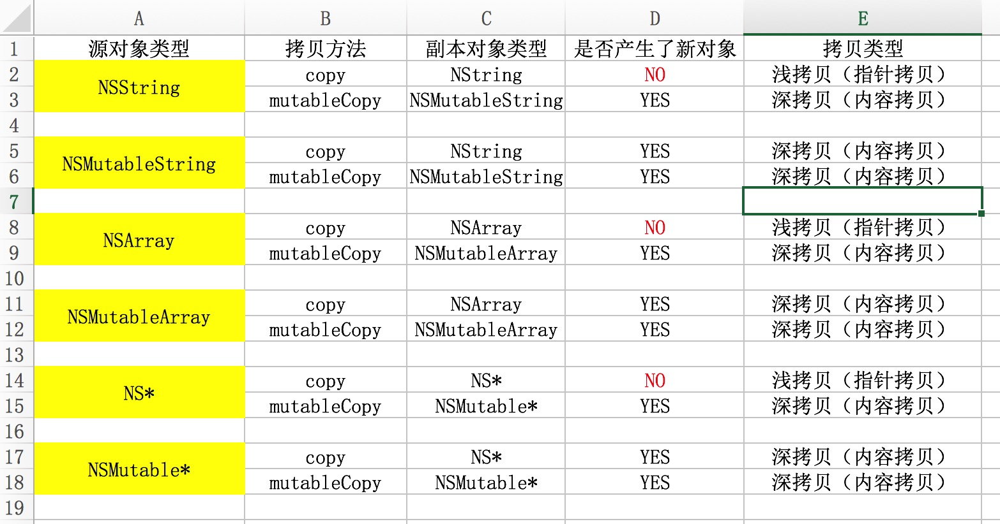

### 0613的问题:

#### 懒加载是通过在get方法中添加if判断实现的，如果为空就创建，不为空直接返回。

* 变量的初始化是可以写在**viewDidLoad**里
  * 放到viewDidLoad里增加阅读难度，代码不简洁
  * 可能会有不用的属性，但是放到viewDidLoad里会创建（实际项目中一般不会，创建的属性都是有用的）

~~~objective-c
- (NSArray *)deals{
    if (!_deals) {
        _deals = [NSArray arrayWithContentsOfFile:[[NSBundle mainBundle] pathForResource:@"tgs.plist" ofType:nil]];
    }
    NSMutableArray *tempArray = [NSMutableArray array];
    for (NSDictionary *dict in _deals) {
        DealModel *model = [DealModel dealWithDict:dict];
        [tempArray addObject:model];
    }
    _deals = tempArray;
    return _deals;
}
~~~

### 修改之后

~~~objective-c
- (NSMutableArray *)deals{
    if (!_deals) {
        _deals = [NSMutableArray array];
        NSArray *tempArray = [NSArray arrayWithContentsOfFile:[[NSBundle mainBundle] pathForResource:@"tgs.plist" ofType:nil]];
        for (NSDictionary *dict in tempArray) {
            DealModel *model = [DealModel dealWithDict:dict];
            [_deals addObject:model];
        }
    }
    return _deals;
}
~~~

### 0614问题

#### 纯代码方式封装控件

- 1.在initWithFrame:方法中添加子控件（此方法中不能设置frame，进行初始化的操作）
- 2.在layoutSubviews方法中设置子控件的frame
- 3.重写模型的set方法

### 0615问题

- 对于tableView插入单行数据时，建议使用insertRowsAtIndexPaths:withRowAnimation方法，因为它有reloadData的功能，且性能更高，只刷新当前行，同时也有删除一行数据的动画效果方法：deleteRowsAtIndexPath:withRowAnimation。reloadData刷新行时是刷新所有行

- 从数组里取出对象不能用.语法，因为从数组中取出的对象是id类型的。

- tableview选中之后可以使用deselectRowIndexPath:方法可以取消选中状态

- 不能一边遍历一边删除数据

- 苹果系统自带的批量操作

  ```objective-c
  self.tableView.allowsMultipleSelectionDuringEditing = YES;
  ```

### 0621问题

* 一般情况下，类似`AFNetworking`的第三方库导入时使用<>,自己自定义的类用“”导入，系统的类也可以使用“”导入。

- 返回cell的估计高度，此方法调用后返回cell高度的方法会在返回cell的方法之后调用

```objective-c
- (CGFloat)tableView:(UITableView *)tableView estimatedHeightForRowAtIndexPath:(NSIndexPath *)indexPath{
    return 150;
}
```

* 不用MVC坏处：

  ~~~objective-c
  1.扩展性低，如添加一个状态的标志，需要修改很多代码
  2.字典的键值对字符串容易写错
  3.字典的值为空值容易导致崩溃，模型的话最多是UI上不显示的问题
  4.可维护性不高，如果后台字段改变，需要修改n多地方，mvc可能就只需修改转模型时一次就行
  ~~~

* 图片拉伸方式

  * 1.最早的拉伸方式,只拉伸1*1px的距离，现在已经过期

  ~~~objective-c
  image = [image stretchableImageWithLeftCapWith:topCapHeight:];
  right = width - left - 1;
  bottom = height - top - 1;
  ~~~

  * 2.

  ~~~objective-c
  UIImage *image = [UIImage imageWithNamed:@"ad"];
  image = [image resizeableImageWithCapInsets:UIEdgeInsetMake(10,10,10,10)]; //表示上下左右分别保护10px的距离
  ~~~

  *  3.不用代码方式，直接在storyboard中拉伸
  *  在storyboard中选中图片库中的图片，然后在右侧属性栏中选择下面“Slicing”中可以选择“水平、垂直”方向进行拉伸，且已经计算完毕拉伸位置和模式！！
     *   

### 0625问题

* KVC/KVO

  * KVC: Key Value Coding, 常见作用：给模型属性赋值
  * KVO: Key Value Observing, 常用作用：监听模型属性值的改变

* KVO用法：

  ~~~objective-c
  1.添加要监听的属性
    [self.p1 addObserver:self forKeyPath:@"name" options: NSKeyValueObservingOptionOld context:nil];
  2.监听属性发生改变时都会调用下面方法，是继承自NSObject的方法，所有对象都能监听
  #pragma mark - KVO监听方法
  /**
   * 当监听到object的keyPath属性发生了改变
   */
  - (void)observeValueForKeyPath:(NSString *)keyPath ofObject:(id)object change:(NSDictionary *)change context:(void *)context
  {
      NSLog(@"监听到%@对象的%@属性发生了改变， %@", object, keyPath, change);
  }
  ~~~

* 代理和通知

  - 代理设计模式的作用:
    - 1.A对象监听B对象的一些行为，A成为B的代理
    - 2.B对象想告诉A对象一些事情，A成为B的代理
  - 代理设计模式的总结：
    - 如果你想监听别人的一些行为，那么你就要成为别人的代理
    - 如果你想告诉别人一些事情，那么就让别人成为你的代理
  - 代理设计模式的开发步骤
    - 1.拟一份协议（协议名字的格式：控件名 + Delegate），在协议里面声明一些代理方法（一般代理方法都是@optional）
    - 2.声明一个代理属性：@property (nonatomic, weak) id<代理协议> delegate;
    - 3.在内部发生某些行为时，调用代理对应的代理方法，通知代理内部发生什么事
    - 4.设置代理：xxx.delegate = yyy;
    - 5.yyy对象遵守协议，实现代理方法

  ~~~objective-c
  注意：代理调用方法时，成为代理的对象不一定实现代理方法，所以一定要判断是否有这个代理方法
    // 告诉代理
      if ([self.delegate  respondsToSelector:@selector(loadMoreFooterDidClickLoadMoreButton:)]) {
          [self.delegate loadMoreFooterDidClickLoadMoreButton:self];
      }
  ~~~

  ​

* 代理属性必须用weak，原因如下：

* static的作用：

  - 修饰局部变量
    - 让局部变量只初始化一次
    - 局部变量在程序中只有一份内存
    - 并不会改变局部变量的作用域，仅仅是改变了局部变量的生命周期（只到程序结束，这个局部变量才会销毁）
  - 修饰全局变量
    - 全局变量的作用域仅限于当前文件

## 实现拷贝的方法

- copy
  - 只会产生不可变的副本对象（比如NSString）
- mutableCopy
  - 只会产生可变的副本对象（比如NSMutableString）
- 

### 0626问题

- 问2-3年iOS开发经验的三个主要方面：
  - 事件处理：响应者链条
  - Runtime
  - RunLoop
- 主线程的主要作用：
  - 显示/刷新UI界面
  - 处理UI事件（比如点击事件、滚动事件、拖拽事件）
- 多线程常用的使用方案
- 一：GCD
  - 1.旨在替代NSThread等线程技术


- 2.充分利用设备的多核
  - 3.C语言编写，自动管理线程生命周期，经常使用
- 二：NSOperation：
  - 1.基于GCD（底层是GCD）
  - 2.比GCD多了一些更简单实用的功能
  - 3.使用更加面向对象
  - 4.OC语言编写，自动管理线程生命周期，经常使用   

### 0628问题：单粒模式

#### 延迟执行的3中方式

- ​

```objective-c
[self performSelector:@selector(run) withObject:nil afterDelay:2.0];
```

- ​

```objective-c
dispatch_after(dispatch_time(DISPATCH_TIME_NOW, (int64_t)(2.0 * NSEC_PER_SEC)), dispatch_get_main_queue(), ^{
            NSLog(@"run-----");
        });
```

- ​

```objective-c
[NSTimer scheduledTimerWithTimeInterval:2.0 target:self selector:@selector(run) userInfo:nil repeats:NO];
```

#### GCD的常见函数

- 屏障：在此之前的函数先执行，在此之后的函数后执行，异步也是一样

```objective-c
dispatch_barrier_async
```

- ​

```objective-c
static dispatch_once_t onceToken;
    dispatch_once(&onceToken, ^{
        NSLog(@"------run");
    });
```

#### 单粒模式

* 调用alloc方法实际上底层是调用allWithZone方法

* 单粒模式的2中实现方式

  * 方式1：GCD方式

  ~~~objective-c
  // .h文件  (name)参数化，前面加##
  #define XMGSingletonH(name) + (instancetype)shared##name;

  // .m文件 1.宏定义：\表示换行，宏可以找到\下面的一行
  //2.alloc方法和copy方法实际上是调用的allocWithZone和copyWithZone方法，为了防止用户调用copy方法创建出第二份内存，实现了copyWithZone方法更严谨
  //3.static 是为了防止外界通过extern修改_instance的值添加的，也是为了安全
  #define XMGSingletonM(name) \
  static id _instance; \
   \
  + (instancetype)allocWithZone:(struct _NSZone *)zone \
  { \
      static dispatch_once_t onceToken; \
      dispatch_once(&onceToken, ^{ \
          _instance = [super allocWithZone:zone]; \
      }); \
      return _instance; \
  } \
   \
  + (instancetype)shared##name \
  { \
      static dispatch_once_t onceToken; \
      dispatch_once(&onceToken, ^{ \
          _instance = [[self alloc] init]; \
      }); \
      return _instance; \
  } \
   \
  - (id)copyWithZone:(NSZone *)zone \
  { \
      return _instance; \
  }
  ~~~

  * 方式2：加锁方式实现单粒：当多个线程同时创建对象时，添加锁可以防止多个线程同时创建对象

  ~~~objective-c
  static id _instance;

  + (instancetype)allocWithZone:(struct _NSZone *)zone
  {
      @synchronized(self) {//加锁的位置，在判断条件外
          if (_instance == nil) {
              _instance = [super allocWithZone:zone];
          }
      }
      return _instance;
  }

  + (instancetype)sharedInstance
  {
      @synchronized(self) {
          if (_instance == nil) {
              _instance = [[self alloc] init];
          }
      }
      return _instance;
  }

  - (id)copyWithZone:(NSZone *)zone
  {
      return _instance;
  }

  ~~~

  ​

### 0629问题:NSOperation

* NSOperation是个抽象类，并不具备封装操作的能力，必须使用它的子类
* 使用NSOperation子类的方式有3种
  * NSInvocationOperation： 用的少，
    * 默认情况下，调用了start方法后并不会开一条新线程去执行操作，而是在当前线程同步执行操作。
    * 只有将NSOperation放到一个NSOperationQueue中，才会异步执行操作
  * NSBlockOperation
  * 自定义子类继承NSOperation，实现内部相应的方法(main方法)

#### GCD的队列类型

- 并发队列
  - 自己创建的
  - 全局
- 串行队列
  - 主队列
  - 自己创建的

#### NSOperationQueue的队列类型

- 主队列
  - [NSOperationQueue mainQueue]
  - 凡是添加到主队列中的任务（NSOperation），都会放到主线程中执行
- 非主队列（其他队列）
  - [[NSOperationQueue alloc] init]
  - 同时包含了：串行、并发功能
  - 添加到这种队列中的任务（NSOperation），就会自动放到子线程中执行